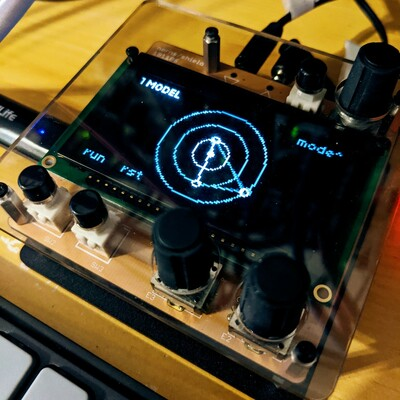

# quintessence
outmoded cosmology in the service of composition

a norns script by noracodes; https://llllllll.co/t/44967 

v0.1.0 (usable but potentially buggy beta)



## requirements

- Norns
- a MIDI output (optional)

## description

quintessence simulates a set of three bodies in orbit around a single unmoving point,
in perfect circles, advancing in accordance with the tempo;
the smallest possible orbit will result in one half a rotation in each and every beat.

melodic information is derived from the relative positions of these bodies.

## controls
- E1 - page/mode
- E2 - select param
- E3 - param value
- K2 - run/stop
- K3 - reset time

## install

https://github.com/noracodes/quintessence

from maiden:

```text
;install https://github.com/noracodes/quintessence
```

## version history

- v0.1.0: modulation matrix for distances, and polyperc options
- v0.0.3: load param defaults and load passthrough if not already loaded.
- v0.0.2: output via PolyPerc. MIDI transport and clock. better organization.
- v0.0.1: initial PoC. MIDI only.

## acknowledgements
thanks to @fardles for an elegant callback-based way to set the limits of params dynamically.

